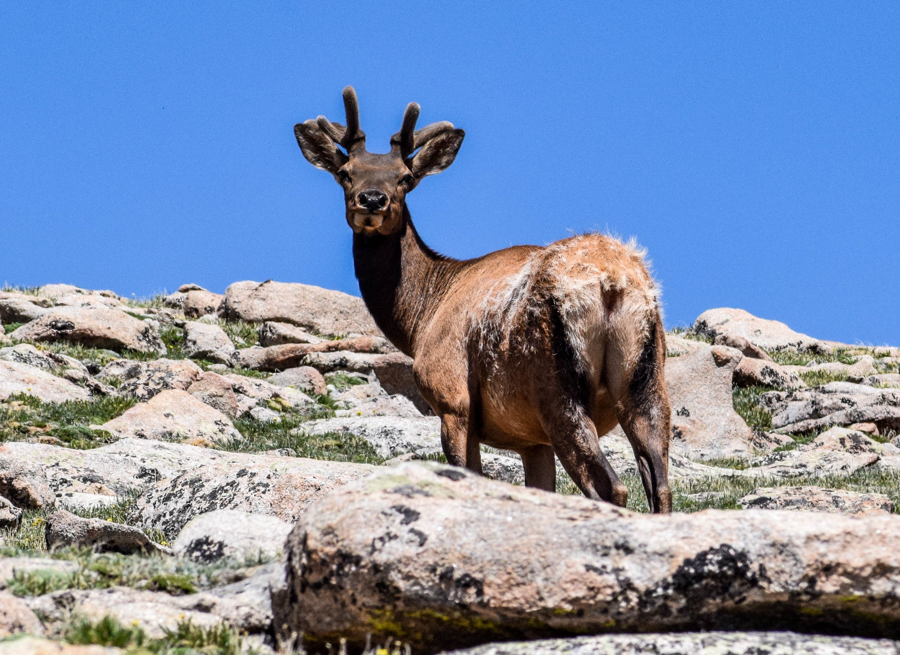
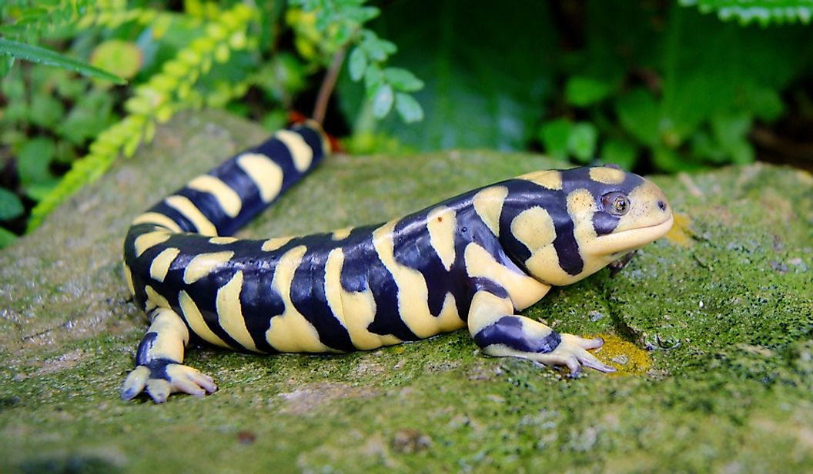

```{r setup, include=FALSE}
knitr::opts_chunk$set(echo = TRUE)
```

## Background

In the previous tutorial users learned how to read in and manage vector and raster datasets.
This tutorial builds upon those skills, while learning how to read spatial data directly into R 
from multiple open-source databases, plot interactive maps and create interactive web applications with the Shiny package.

## Set up
First read in the necessary packages. This section of code uses a function I wrote to improve reproducibility of scripts, where users just provide a list of package names and if the package is not yet installed on the user's computer it installs it and loads it, while if users already have it installed it is just loaded.

```{r warning=FALSE, message=FALSE}
packageLoad <-
  function(x) {
    for (i in 1:length(x)) {
      if (!x[i] %in% installed.packages()) {
        install.packages(x[i])
      }
      library(x[i], character.only = TRUE)
    }
  }

packageLoad(c("raster", "dplyr", "rgbif", "tmap", "shiny"))

```

## Importing Data

While the last tutorial showed you how to load in spatial data from a file, here I am going to give a few examples of how you can load data directly into R from multiple open-source databases.

In this example I am going to show you how to easily import occurrence data from the Global Biodiversity Information facility (GBIF) using the `rgbif` package for a couple species found throughout Colorado pictured below:


{width=50%}


{width=50%} 


{width=50%}

<br>

I am also going to show you how to import administrative and environmental data using the `getData` function from the `raster` package.

<br>

First create a temp directory to temporarily store the loaded data. This folder gets removed from your computer when you close the R session, so these files are not getting stored to your computer.
```{r eval=TRUE}
tempdir <- tempdir()
```

Next, import the administrative boundaries for Colorado to crop the occurrence and environmental data to. We can do this with the `raster` package, which imports boundaries in the form of a SpatialPolygonsDataFrame.

```{r}
colorado <- getData("GADM", country = 'USA', level = 1, path = tempdir) %>% 
  subset(NAME_1 == 'Colorado')

#make an extent object to clip data to
ext <- extent(colorado) 
```


## Occurence Data
Now import the occurrence data for the three species filtered to the state of Colorado, clean it, combine all the data, and convert the final data frame to a SpatialPointsDataFrame
```{r message=FALSE, results="hide"}
#make a string of species names to use in the 'occ_data' function
species <- c("Cervus canadensis", "Marmota flaviventris", "Ambystoma mavortium")

#also make a string of common names to use for plotting later
common_name <- c("Elk", "Yellow-bellied Marmot", "Western Tiger Salamander")

#write a for loop to extract occurrence data for each species

## #create an empty vector to store each species' downloaded occurrence data
occ <- vector("list", length = length(species)) 
for(i in 1:length(occ)){
  
  occ[[i]] <-
    occ_data(
      scientificName = species[i],
      hasCoordinate = TRUE,
      geometry = bbox(ext),
      limit = 2000
    ) %>%
    .$data #return just the data frame
  
  # add species name column as ID to use later
  occ[[i]]$ID <- common_name[i]
  
  #clean by removing duplicate occurrences
  occ[[i]] <-
    occ[[i]] %>% distinct(decimalLatitude, decimalLongitude, .keep_all = TRUE) %>%
    select(Species = ID,
           decimalLatitude,
           decimalLongitude,
           year,
           month,
           basisOfRecord) #only keep relevant variables
  
  
  
  print(i) # this prints each element once its finished so you can see the progress
  
}

# Bind all data frames together
occ <- do.call("rbind", occ) 

#need to edit year and month from numeric to character for display later
occ$year_char <- as.character(occ$year)
occ$month <- month.abb[occ$month]

#make spatial points data frame
occ_sp <- SpatialPointsDataFrame(coords = occ[,c("decimalLongitude", "decimalLatitude")],
                                 data = occ)


```


## Elevation Data
Next import elevation data for the state of Colorado using the same `getData` function from the `raster` package
```{r message=FALSE, warning=FALSE}
elev <- getData("alt", country = "USA", mask = TRUE, path = tempdir) 
elev <- elev[[1]] #just keep first element that is continental US

elev <- crop(elev, colorado) #crop to the colorado polygon

```

<br>

# Species Elevation

Say we want to analyze species occurrences at difference elevations. We can use the `extract` function in the `raster` package to make a new column in our spatial occurrence dataset with the elevation of each point
```{r}
occ_sp$elevation <- raster::extract(elev, occ_sp)

```

## Interactive Vizualization

In the last tutorial you were introduced to the `tmap` package for plotting maps. I'm going to expand upon that by creating an interactive map of our occurrence and elevation data with customized pop-ups for each occurrence that displays the metadata
```{r message=FALSE, warning=FALSE}
#first get occurrences in same projection as raster layer
proj4string(occ_sp) <- crs(elev)


#initiate an interactive tmap opject
tmap_mode("view")

tm_basemap("OpenStreetMap")+
    #add occurrences
      tm_shape(shp = occ_sp)+
  #color the points by species and add pop-ups for each point with the metadata
  tm_dots(
    col = "Species",
    size = 0.1,
    palette = "Dark2",
    title = "Species Occurences",
    popup.vars = c(
      "Record Type" = "basisOfRecord",
      "Year" = "year_char",
      "Month" = "month",
      "Elevation (m)" = "elevation"
    ),
    id = "Species"
  ) +
  #add elevation
      tm_shape(elev) +
  #add title and slight transparency to view basemap
      tm_raster(alpha = 0.8, title = "Elevation (m)")


```
Now you can move around the map, turn layers on and off, and click on individual occurrences to view metadata such as when the occurrence was recorded, the type of observation, and the exact elevation at that point.

## Shiny App

Finally, I am going to show you a brief example of Shiny applications. These are interactive web applications built with the `shiny` package that allow users to interact with the data being visualized. Shiny apps have two main components, the user interface object (ui) and a server function (server) that communicate with one another. The app is built with a call to the `shinyApp` function. Shiny apps are contained in a single script called `app.R`

```{r message=FALSE, warning=FALSE}
#Define the user interface (ui) 

ui = fluidPage(
  
  # App Title
  titlePanel("Species of Colorado"),
  
  #Add some header information
  h5(
    "This map shows occurrence data for multiple Colorado species downloaded from GBIF using the",
    code("rgbif"),
    "package."
  ),
  h5(
    "In this app you can filter the points on the map by species, date of observation, and elevation."
  ),
  h5("You can also click on individual occurrences on the map to view the metadata."),
  
  
  
  #Sidebar layout with input and output definitions
  
  sidebarLayout(
    
    #Sidebar panel for outputs, these are the elements users can interact with
    
    sidebarPanel(
      
      #First input: Species
      checkboxGroupInput(
        inputId = "species",
        label = "Species",
        choices = list(
          "Elk" = "Elk",
          "Yellow-bellied Marmot" = "Yellow-bellied Marmot",
          "Western Tiger Salamander" = "Western Tiger Salamander"
        ),
        selected = c("Elk", "Yellow-bellied Marmot", "Western Tiger Salamander")
      ),
      
      # Second input: Year
      sliderInput(inputId = "year", label = "Year",
                  min = 1800, max = 2021, value = c(1800, 2021), sep=""),

      # Third input: Month 
      checkboxGroupInput(inputId = "month", label = "Month",
                         choices = list("Jan" = "Jan", "Feb" = "Feb", "Mar" = "Mar",
                                        "Apr" = "Apr", "May" = "May", "Jun" = "Jun",
                                        "Jul" = "Jul", "Aug" = "Aug", "Sep" = "Sep",
                                        "Oct" = "Oct", "Nov" = "Nov", "Dec" = "Dec"),
                         selected = c("Jan", "Feb", "Mar", "Apr", "May", "Jun", "Jul",
                                      "Aug", "Sep", "Oct", "Nov", "Dec")
                                        ),

      #Fourth input: elevation 
    sliderInput(inputId = "elevation", label = "Elevation",
                min = 1000, max = 4500, value = c(1000, 4500))
    
    
    ),
    
    mainPanel(
      tmapOutput("map")
    )
    
  )
  
  
)


# Define the Server 

server <- function(input, output){
  

  output$map <- renderTmap({
    
    #Filter species selected
    species <- subset(occ_sp, Species %in% input$species)
    
    #Filter elevation selected
    species_elev <-
      subset(species,
             elevation >= input$elevation[1] & elevation <= input$elevation[2])
    
    #render interactive tmap
    tmap::tmap_mode("view")
    tmap::tm_basemap("OpenStreetMap")+
      tmap::tm_shape(shp = species_elev)+
      tmap::tm_dots(
        col = "Species",
        size = 0.1,
        palette = "Dark2",
        title = "Species Occurences",
        popup.vars = c(
          "Record Type" = "basisOfRecord",
          "Year" = "year",
          "Month" = "month",
          "Elevation (m)" = "elevation"
        ),
        id = "Species"
      ) +
      tmap::tm_shape(elev) +
      tmap::tm_raster(alpha = 0.8, title = "Elevation (m)")
      
    
  })

 
  
}


```

Then this line of code will create the Shiny app, which will pop up in a new, interactive window.
```{r eval = FALSE}

shinyApp(ui = ui, server = server)
```


You can view the live version of the app [here](https://ccmothes.shinyapps.io/ColoradoSpecies/). Hosting your shiny apps for others to use is easy and free with [Shinyapps.io](https://www.shinyapps.io/?_ga=2.132356622.1013687155.1618577881-1168783717.1617904840).

<br>

Hope you enjoyed this tutorial! 